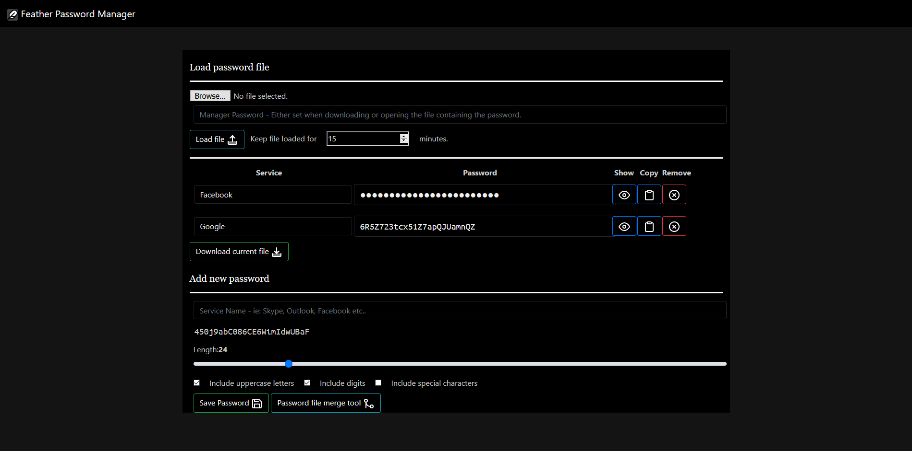

# Feather Password Manager
***
###### This Is Forked Version of Xaeroxe's Feather Password Manager
###### This version is maintained by Yeehawlerz101.

This is a highly portable extremely light-weight password manager that stores
all your passwords in a local encrypted file.
You can use this either by downloading the latest [release](https://github.com/Xaeroxe/FeatherPasswordManager/releases) and opening index.html, or you can
use it at this URL: https://xaeroxe.github.io/FeatherPasswordManager/index.html

## Features
- Load and save password files encrypted with a password
- Generate random passwords that satisfy the provided criteria. Options include
  - Length requirement
  - Include uppercase letters
  - Include digits
  - Include various punctuation characters
- Quickly copy passwords to clipboard
- Manually edit passwords if the random generator doesn't quite get it right
- No backend server required, just open the index.html file and get started.
- Responsive Design & Bootstrap 4.1.3
## Screenshot

## Philosophy and objectives
- Stay under 200 KB
- Work correctly in as many browsers and on as many devices as possible
- Extremely responsive, no waiting around
- High security encryption algorithm (AES)
- Maintain backwards compatibility with password files output by earlier versions
- No backend server required, all functionality implemented via local JavaScript.

## Licensing
This project is released under the MIT license, additional dependencies come
with their own licenses which are detailed in their files.

## Contributions
I welcome contributions! I also expect any PRs to respect the philosophy and
objectives of this project.
